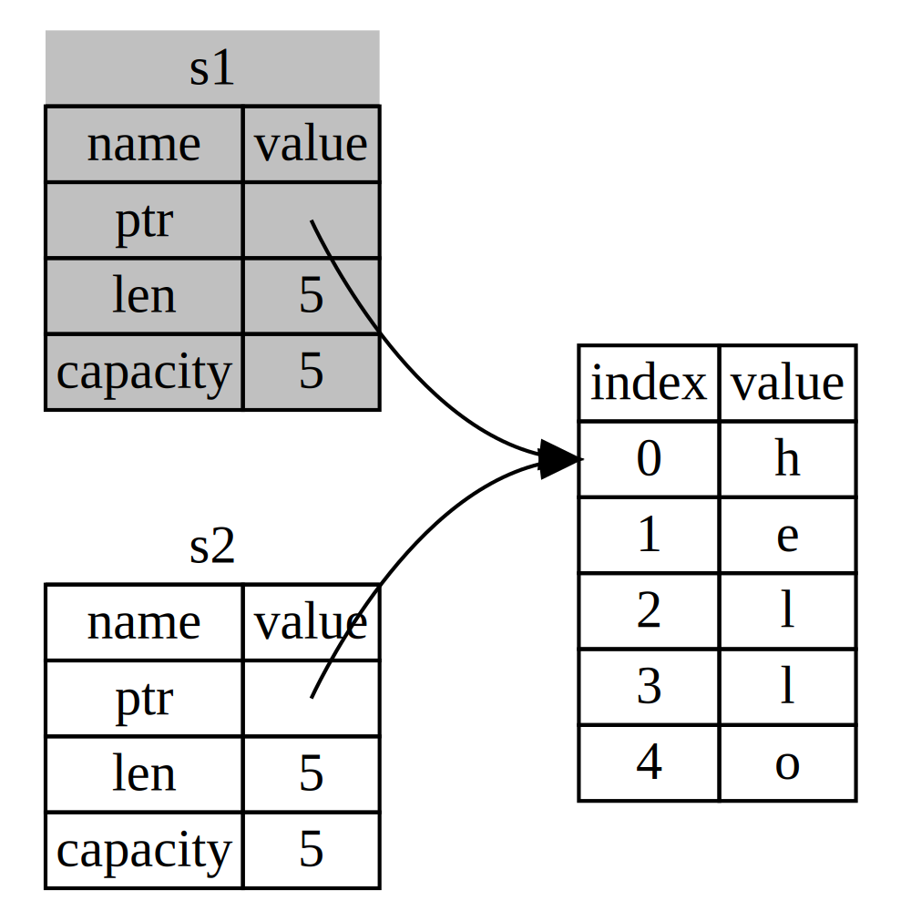

[Main Table of Content](./../index.md)

# Ownership

<!-- @import "[TOC]" {cmd="toc" depthFrom=1 depthTo=6 orderedList=false} -->

<!-- code_chunk_output -->

- [Ownership](#ownership)
  - [About Ownership](#about-ownership)
  - [The Stack and the Heap](#the-stack-and-the-heap)
  - [Ownership Rules](#ownership-rules)
  - [Variable Scope](#variable-scope)
  - [The `String` Type](#the-string-type)
  - [Memory and Allocation](#memory-and-allocation)
  - [Variables and Data Interacting with `Move`](#variables-and-data-interacting-with-move)
  - [Variables and Data Interacting with `Clone`](#variables-and-data-interacting-with-clone)
  - [stack-Only Data: `Copy`](#stack-only-data-copy)
  - [Ownership and Functions](#ownership-and-functions)
  - [Return Values and Scope](#return-values-and-scope)

<!-- /code_chunk_output -->

## About Ownership

Ownership is a set of rules that govern how a Rust program manages memory. All programs have to manage the way they use a computer’s memory while running. Some languages have garbage collection that regularly looks for no-longer-used memory as the program runs; in other languages, the programmer must explicitly allocate and free the memory. 
Rust uses a third approach:<u> memory is managed through a system of ownership with a set of rules that the compiler checks.</u> If any of the rules are violated, the program won’t compile. None of the features of ownership will slow down your program while it’s running.

## The Stack and the Heap

In a systems programming language like Rust, whether a value is on the stack or the heap affects how the language behaves and why you have to make certain decisions. Parts of ownership will be described in relation to the stack and the heap.
Both the stack and the heap are parts of memory available to your code to use at runtime, but they are structured in different ways. 

!!!
    - The **stack** stores values in the order it gets them and removes the values in the opposite order. This is referred to as last in, first out (LIFO). 
    - Adding data is called pushing onto the stack, and removing data is called popping off the stack. All data stored on the stack must have a known, fixed size. 
    - Data with an unknown size at compile time or a size that might change must be stored on the heap instead.

!!!
    - The **heap** is less organized: when you put data on the heap, you request a certain amount of space. The memory allocator finds an empty spot in the heap that is big enough, marks it as being in use, and returns a pointer, which is the address of that location. This process is called **allocating on the heap** and is sometimes abbreviated as just allocating. Because the pointer to the heap is a known, fixed size, you can store the pointer on the stack, but when you want the actual data, you must follow the pointer.
    - Pushing to the stack is faster than allocating on the heap because the allocator never has to search for a place to store new data; that location is always at the top of the stack. Comparatively, allocating space on the heap requires more work because the allocator must first find a big enough space to hold the data and then perform bookkeeping to prepare for the next allocation.
    - Accessing data in the heap is slower than accessing data on the stack because you have to follow a pointer to get there. 
    - When your code calls a function, the values passed into the function (including, potentially, pointers to data on the heap) and the function’s local variables get pushed onto the stack. When the function is over, those values get popped off the stack.

Keeping track of what parts of code are using what data on the heap, minimizing the amount of duplicate data on the heap, and cleaning up unused data on the heap so you don’t run out of space are all problems that ownership addresses. Once you understand ownership, you won’t need to think about the stack and the heap very often, but knowing that the main purpose of ownership is to manage heap data can help explain why it works the way it does.

## Ownership Rules

First, let’s take a look at the ownership rules. Keep these rules in mind as we work through the examples that illustrate them:

- Each value in Rust has an owner.
- There can only be one owner at a time.
- When the owner goes out of scope, the value will be dropped.

## Variable Scope

As a first example of ownership, we’ll look at the **scope** of some variables. 

!!!
    A **scope** is the range within a program for which an item is valid. 
    
Take the following variable:

```rust
let s = "hello";
```

The variable `s` refers to a string literal, where the value of the string is hardcoded into the text of our program. The variable is valid from the point at which it’s declared until the end of the current scope.


```rust
{                      // s is not valid here, it’s not yet declared
    let s = "hello";   // s is valid from this point forward
    // do stuff with s
}                      // this scope is now over, and s is no longer valid
```

In other words, there are two important points in time here:

- When s comes into scope, it is valid.
- It remains valid until it goes out of scope.
  
At this point, the relationship between scopes and when variables are valid is similar to that in other programming languages. Now we’ll build on top of this understanding by introducing the `String` type.

## The `String` Type

To illustrate the rules of ownership, we need a data type that is more complex than those we covered in the *Data Types* section. The types covered previously are of a known size, can be stored on the stack and popped off the stack when their scope is over, and can be quickly and trivially copied to make a new, independent instance if another part of code needs to use the same value in a different scope. But we want to look at data that is stored on the heap and explore how Rust knows when to clean up that data, and the `String` type is a great example.

We’ll concentrate on the parts of String that relate to ownership. These aspects also apply to other complex data types, whether they are provided by the standard library or created by you.

We’ve already seen string literals, where a string value is hardcoded into our program. String literals are convenient, but they aren’t suitable for every situation in which we may want to use text. One reason is that they’re immutable. Another is that not every string value can be known when we write our code: for example, what if we want to take user input and store it? For these situations, Rust has a second string type, `String`. This type manages data allocated on the heap and as such is able to store an amount of text that is unknown to us at compile time. You can create a `String` from a string literal using the from function, like so:

```rust
let s = String::from("hello");
```

The double colon `::` operator allows us to namespace this particular from function under the `String` type rather than using some sort of name like `string_from`. We’ll discuss this syntax more in the *Method Syntax* section, and when we talk about `namespacing` with modules in *Paths for Referring to an Item in the Module Tree*.

This kind of string can be mutated:

```rust
let mut s = String::from("hello");
s.push_str(", world!"); // push_str() appends a literal to a String
println!("{}", s); // This will print `hello, world!`
```

So, what’s the difference here? Why can String be mutated but literals cannot? The difference is in how these two types deal with memory.

## Memory and Allocation

In the case of a string literal, we know the contents at compile time, so the text is hardcoded directly into the final executable. This is why string literals are fast and efficient. But these properties only come from the string literal’s immutability. Unfortunately, we can’t put a blob of memory into the binary for each piece of text whose size is unknown at compile time and whose size might change while running the program.

With the `String` type, in order to support a mutable, growable piece of text, we need to allocate an amount of memory on the heap, unknown at compile time, to hold the contents. This means:

- The memory must be requested from the memory allocator at runtime.
- We need a way of returning this memory to the allocator when we’re done with our String.

That first part is done by us: when we call `String::from`, its implementation requests the memory it needs. This is pretty much universal in programming languages.

However, the second part is different. In languages with a garbage collector (GC), the GC keeps track of and cleans up memory that isn’t being used anymore, and we don’t need to think about it. In most languages without a GC, it’s our responsibility to identify when memory is no longer being used and to call code to explicitly free it, just as we did to request it. Doing this correctly has historically been a difficult programming problem. If we forget, we’ll waste memory. If we do it too early, we’ll have an invalid variable. If we do it twice, that’s a bug too. We need to pair exactly one allocate with exactly one free.

Rust takes a different path: <u>the memory is automatically returned once the variable that owns it goes out of scope</u>. Here’s a version of our scope example using a `String` instead of a string literal:

```rust
{
    let s = String::from("hello"); // s is valid from this point forward
    // do stuff with s
}       // this scope is now over, and s is no
        // longer valid
```

There is a natural point at which we can return the memory our String needs to the allocator: <u>when `s` goes out of scope</u>. When a variable goes out of scope, Rust calls a special function for us. This function is called `drop`, and it’s where the author of `String` can put the code to return the memory. **Rust calls `drop` automatically at the closing curly bracket.**

This pattern has a profound impact on the way Rust code is written. It may seem simple right now, but the behavior of code can be unexpected in more complicated situations when we want to have multiple variables use the data we’ve allocated on the heap. Let’s explore some of those situations now.

## Variables and Data Interacting with `Move`

Multiple variables can interact with the same data in different ways in Rust. Let’s look at an example using an integer:

```rust
let x = 5;
let y = x;
```

We can probably guess what this is doing: *bind the value `5` to `x`; then make a copy of the value in `x` and bind it to `y`.* We now have two variables, `x` and `y`, and both equal `5`. This is indeed what is happening, because integers are simple values with a known, fixed size, and these two `5` values are pushed onto the stack.

Now let’s look at the `String` version:

```rust
let s1 = String::from("hello");
let s2 = s1;
```

This looks very similar, so we might assume that the way it works would be the same: that is, the second line would make a copy of the value in s1 and bind it to s2. But this isn’t quite what happens.

Take a look at the image below to see what is happening to `String` under the covers. A `String` is made up of three parts, shown on the left: 

- a **pointer** to the memory that holds the contents of the string
- a **length**
- a **capacity**

This group of data is stored on the stack. On the right is the memory on the heap that holds the contents.


The **length** is how much memory, in bytes, the contents of the `String` are currently using. The **capacity** is the total amount of memory, in bytes, that the `String` has received from the allocator. The difference between length and capacity matters, but not in this context, so for now, it’s fine to ignore the capacity.

When we assign `s1` to `s2`, the `String` data is copied, meaning we copy the pointer, the length, and the capacity that are on the stack. We do not copy the data on the heap that the pointer refers to. In other words, the data representation in memory looks like the image below: 


The representation does not look like the image below, which is what memory would look like if Rust instead copied the heap data as well. If Rust did this, the operation s2 = s1 could be very expensive in terms of runtime performance if the data on the heap were large.


Earlier, we said that when a variable goes out of scope, Rust automatically calls the `drop` function and cleans up the heap memory for that variable. But the second image shows both data pointers pointing to the same location. This is a problem: when `s2` and `s1` go out of scope, they will both try to free the same memory. This is known as a *double free error* and is one of the memory safety bugs we mentioned previously. Freeing memory twice can lead to memory corruption, which can potentially lead to security vulnerabilities.

To ensure memory safety, after the line let `s2 = s1;`, Rust considers `s1` as no longer valid. Therefore, Rust doesn’t need to free anything when `s1` goes out of scope.

when you try to use s1 after s2 is created; it won’t work:

```rust
let s1 = String::from("hello");
let s2 = s1;

println!("{}, world!", s1); // error[E0382]: borrow of moved value: `s1`
```

If you’ve heard the terms *shallow copy* and *deep copy* while working with other languages, the concept of copying the pointer, length, and capacity without copying the data probably sounds like making a shallow copy. But <u>because Rust also invalidates the first variable, instead of being called a shallow copy, it’s known as a move</u>. In this example, we would say that `s1` was moved into `s2`. So, what actually happens is shown in the image below.



That solves our problem! With only `s2` valid, when it goes out of scope it alone will free the memory, and we’re done.

In addition, there’s a design choice that’s implied by this: Rust will never automatically create *deep* copies of your data. Therefore, any *automatic* copying can be assumed to be inexpensive in terms of runtime performance.

## Variables and Data Interacting with `Clone`

If we do want to deeply copy the heap data of the `String`, not just the stack data, we can use a common method called `clone`. We’ll discuss method syntax in coming chapters, but because methods are a common feature in many programming languages, you’ve probably seen them before.

Here’s an example of the `clone` method in action:

```rust
let s1 = String::from("hello");
let s2 = s1.clone();

println!("s1 = {}, s2 = {}", s1, s2);
```

This works just fine and explicitly produces the behavior shown in the third image, also shown below, where the heap data does get copied.


When you see a call to `clone`, you know that some arbitrary code is being executed and that code may be expensive. It’s a visual indicator that something different is going on.

## stack-Only Data: `Copy`

There’s another wrinkle we haven’t talked about yet. This code using integers works and is valid:

```rust
let x = 5;
let y = x;

println!("x = {}, y = {}", x, y);
```

But this code seems to contradict what we just learned: we don’t have a call to `clone`, but `x` is still valid and wasn’t moved into `y`.

The reason is that types such as `integers` that have a known size at compile time are stored entirely on the stack, so copies of the actual values are quick to make. That means there’s no reason we would want to prevent `x` from being valid after we create the variable `y`. In other words, there’s no difference between *deep* and *shallow* copying here, so calling `clone` wouldn’t do anything different from the usual `shallow` copying, and we can leave it out.

Rust has a special annotation called the `Copy` trait that we can place on types that are stored on the stack, as integers are. <u>If a type implements the `Copy` trait, variables that use it do not move, but rather are trivially copied, making them still valid after assignment to another variable.</u>

Rust won’t let us annotate a type with `Copy` if the type, or any of its parts, has implemented the `Drop` trait. If the type needs something special to happen when the value goes out of scope and we add the `Copy` annotation to that type, we’ll get a compile-time error.

So, what types implement the `Copy` trait? You can check the documentation for the given type to be sure, but as a general rule, any group of simple scalar values can implement `Copy`, and nothing that requires allocation or is some form of resource can implement `Copy`. Here are some of the types that implement `Copy`:

- All the `integer` types, such as `u32`.
- The Boolean type, `bool`, with values `true` and `false`.
- All the `floating-point` types, such as `f64`.
- The character type, `char`.
- Tuples, if they only contain types that also implement `Copy`. For example, `(i32, i32)` implements `Copy`, but `(i32, String)` does not.

## Ownership and Functions

The mechanics of passing a value to a function are similar to those when assigning a value to a variable. Passing a variable to a function will *move* or *copy*, just as assignment does. In the code below, it has an example with some annotations showing where variables go into and out of scope.

```rust
fn main() {
    let s = String::from("hello");  // s comes into scope

    takes_ownership(s);             // s's value moves into the function...
                                    // ... and so is no longer valid here

    let x = 5;                      // x comes into scope

    makes_copy(x);                  // x would move into the function,
                                    // but i32 is Copy, so it's okay to still
                                    // use x afterward

} // Here, x goes out of scope, then s. But because s's value was moved, nothing
  // special happens.

fn takes_ownership(some_string: String) { // some_string comes into scope
    println!("{}", some_string);
} // Here, some_string goes out of scope and `drop` is called. The backing
  // memory is freed.

fn makes_copy(some_integer: i32) { // some_integer comes into scope
    println!("{}", some_integer);
} // Here, some_integer goes out of scope. Nothing special happens.

```

If we tried to use s after the call to `takes_ownership`, Rust would throw a compile-time error. These static checks protect us from mistakes.

## Return Values and Scope

Returning values can also transfer ownership. The code below shows an example of a function that returns some value.

```rust
fn main() {
    let s1 = gives_ownership();         // gives_ownership moves its return
                                        // value into s1

    let s2 = String::from("hello");     // s2 comes into scope

    let s3 = takes_and_gives_back(s2);  // s2 is moved into
                                        // takes_and_gives_back, which also
                                        // moves its return value into s3
} // Here, s3 goes out of scope and is dropped. s2 was moved, so nothing
  // happens. s1 goes out of scope and is dropped.

fn gives_ownership() -> String {             // gives_ownership will move its
                                             // return value into the function
                                             // that calls it

    let some_string = String::from("yours"); // some_string comes into scope

    some_string                              // some_string is returned and
                                             // moves out to the calling
                                             // function
}

// This function takes a String and returns one
fn takes_and_gives_back(a_string: String) -> String { // a_string comes into
                                                      // scope

    a_string  // a_string is returned and moves out to the calling function
}
```

The ownership of a variable follows the same pattern every time: assigning a value to another variable moves it. When a variable that includes data on the heap goes out of scope, the value will be cleaned up by drop unless ownership of the data has been moved to another variable.

While this works, taking ownership and then returning ownership with every function is a bit tedious. What if we want to let a function use a value but not take ownership? It’s quite annoying that anything we pass in also needs to be passed back if we want to use it again, in addition to any data resulting from the body of the function that we might want to return as well.

Rust does let us return multiple values using a tuple, as shown below.

```rust
fn main() {
    let s1 = String::from("hello");

    let (s2, len) = calculate_length(s1);

    println!("The length of '{}' is {}.", s2, len);
}

fn calculate_length(s: String) -> (String, usize) {
    let length = s.len(); // len() returns the length of a String

    (s, length)
}
```

But this is too much ceremony and a lot of work for a concept that should be common. Luckily for us, Rust has a feature for using a value without transferring ownership, called *references*.

